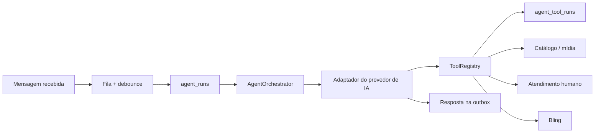

# Núcleo de agentes

O agente é um módulo do backend, não um workflow externo. Ele recebe uma conversa consolidada pela fila, tem acesso somente às ferramentas registradas e registra toda ação no PostgreSQL.

## Estado atual

O `DisabledAgentProvider` é intencional. Ele cria uma execução auditável com estado `waiting_configuration` e não envia resposta ao cliente. Nenhuma credencial é necessária para desenvolver ou validar a estrutura.

O playbook comercial da Lilibag é carregado antes da execução e sua versão fica registrada em `agent_runs.prompt_version`, mesmo enquanto o provedor estiver desativado. Veja [o playbook operacional](./lilibag-agent-playbook.md).

Quando o provedor de IA for ativado, ele implementará a interface `AgentProvider`. Ele recebe os schemas das ferramentas e uma função controlada para executá-las; não ganha acesso direto ao banco ou aos segredos do sistema.

## Ferramentas já registradas

| Ferramenta | Efeito | Estado atual |
| --- | --- | --- |
| `search_products` | pesquisa híbrida no catálogo interno, com filtros comerciais e mídias | funcional sem embeddings; vetor preparado |
| `get_product_media` | obtém mídias de um produto da mesma organização | funcional |
| `get_sales_context` | recupera etapa e fatos comerciais não sensíveis | funcional |
| `update_sales_context` | registra etapa e fatos comerciais não sensíveis | funcional |
| `handoff_to_human` | coloca a conversa em atendimento humano com auditoria | funcional quando chamada pelo provedor |
| `get_bling_order_status` | contrato de consulta de pedido | retorna `integration_not_configured` até o OAuth do Bling |

Toda chamada passa por validação Zod, isolamento por organização e gravação em `agent_tool_runs`. Uma ferramenta desconhecida ou argumentos inválidos são rejeitados e auditados.

## Regras para o adaptador futuro

1. Só pode usar as ferramentas declaradas pelo `ToolRegistry`.
2. Não envia mensagem diretamente: cria a intenção na outbox.
3. Nunca retorna raciocínio interno ao cliente.
4. Antes de informar produto, preço, foto ou estoque, consulta o catálogo interno.
5. Encaminha a conversa para equipe em intenção de compra, pagamento, CEP, situação sensível ou pedido explícito.
