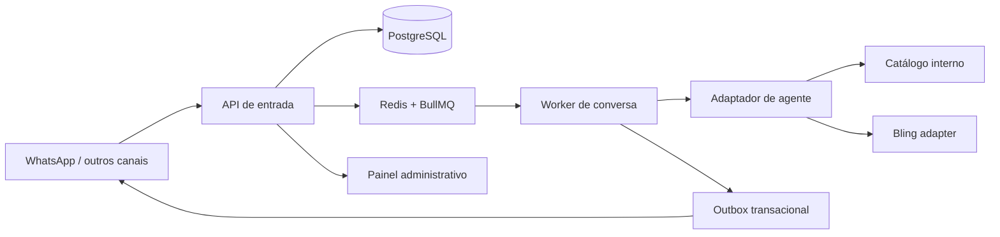

# Arquitetura inicial

## Regras estruturais

1. **PostgreSQL é a verdade**. Redis não guarda a única cópia de uma mensagem.
2. Todo webhook usa uma chave idempotente; repetir uma entrega não pode criar outra mensagem.
3. Há uma fila por tipo de trabalho e lock por conversa. Uma nova mensagem adia a execução por alguns segundos, evitando respostas fragmentadas.
4. Mudanças externas (enviar mensagem, chamar Bling) saem pelo padrão **outbox**. Assim uma falha não perde a intenção de envio.
5. Credenciais de canal, Bling e IA ficam fora do código e dos logs. Em produção serão cifradas por uma chave de cofre/KMS.
6. A primeira versão registra uma execução de agente como `waiting_configuration` enquanto não houver provedor de IA configurado; ela nunca simula resposta ao cliente.

## Roteamento antes da IA

Antes de criar uma execução de agente, o worker consulta as políticas ativas da organização. A primeira regra aplicável, em ordem de prioridade, pode adicionar tags à conversa, manter a automação, pausá-la ou transferir para atendimento humano. Conversas `waiting_human` e `closed` nunca voltam ao agente automaticamente.

Tags são entidades próprias, com escopo `product`, `conversation` ou `contact`. Elas não dependem do texto livre retornado pelo modelo e cada atribuição informa sua origem (`manual`, `rule`, `agent` ou `integration`).

## Catálogo Bling

O catálogo local é a fonte de leitura do atendimento. Uma sincronização Bling cria uma execução auditável por organização, protegida contra duas execuções simultâneas. O schema já preserva identificador externo, estoque, data de origem, hash e resultado da execução. Enquanto o OAuth e o adaptador HTTP não forem ativados, a execução termina em `waiting_configuration`; ela nunca simula dados ou chama o Bling sem credencial.

## Limites de responsabilidade

| Camada | Responsabilidade |
| --- | --- |
| API | autenticar entrada, validar payload, persistir e enfileirar |
| Worker | montar contexto, controlar lock, executar ferramentas e produzir outbox |
| Adaptadores | canais, Bling, catálogo, IA e mídia |
| Painel | operação humana, handoff, histórico, filas, configurações e auditoria |
| Integrações diretas | validação de webhook, OAuth, rate limits, recebimento e envio nos provedores |
